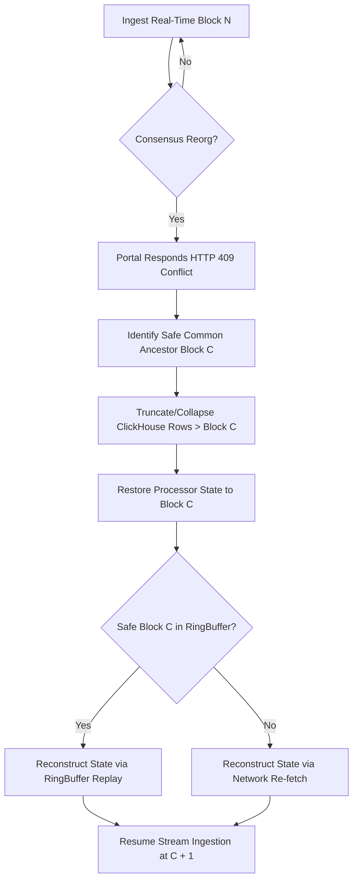

# Blockchain Fork Detection & State Management Reference

This document describes how blockchain forks/reorgs are detected and handled when consuming real-time data streams using Subsquid's `pipes-sdk` and the Go-based high-performance ingestion engine (`sqd-go`). It outlines the exact cursor, pagination, and fetching settings required to trigger fork detection, and explains how to prevent silent data corruption.

---

## 1. High-Level Overview

In distributed blockchain networks (like Ethereum, Polygon, or Arbitrum), different nodes can temporarily disagree on the latest blocks, creating temporary split branches called **forks** or **re-organizations (reorgs)**. 

When a stream consumer is operating near the head of the chain (in "real-time" mode), it might ingest blocks from a branch that is subsequently abandoned by consensus. When this occurs, the consumer's local database diverges from the canonical consensus. To resolve this, the system must perform a **Fork Rollback & Reconstruction** sequence:



---

## 2. The Trigger State: HTTP 409 Conflict

Forks are detected during fetching via the `ParentBlockHash` parameter. When the client makes a streaming request to the Subsquid portal, it specifies:
- `fromBlock`: The next block number to ingest.
- `parentBlockHash`: The block hash of the parent block (`fromBlock - 1`).

```json
{
  "type": "evm",
  "fromBlock": 12345679,
  "toBlock": 12345700,
  "parentBlockHash": "0x1d2f...3a4b",
  "includeAllBlocks": true
}
```

The portal server validates this request against its consensus tree:
- **Consensus Match**: If the block at height `fromBlock - 1` in the portal's active canonical branch has the hash `"0x1d2f...3a4b"`, the portal processes the stream normally and returns HTTP `200` or `204`.
- **Consensus Mismatch**: If the canonical hash at that height is different, a fork has occurred. The portal rejects the query with an **HTTP 409 Conflict** error.

### Portal Fork Response Schema
The portal returns a JSON payload containing the block cursors of the current canonical chain at or below the requested height:
```json
{
  "previousBlocks": [
    { "number": 12345676, "hash": "0xabc...111" },
    { "number": 12345677, "hash": "0xdef...222" },
    { "number": 12345678, "hash": "0x987...333" }
  ]
}
```

---

## 3. Settings Matrix: What Produces or Prevents a Fork?

Fork detection and rollbacks only work when the client is configured with specific settings. If these settings are misconfigured, the client will either **never detect forks** (leading to silent data corruption) or **never receive forks**.

| Parameter | Configuration Options | Fork Behavior & Impact |
| :--- | :--- | :--- |
| **Stream Endpoint / Finality** | `finalized: true`<br>(`/finalized-stream`) | **Forks are IMPOSSIBLE.** Finalized blocks are immutable and mathematically guaranteed never to reorganize. No forks will ever be triggered. |
| | `finalized: false`<br>(`/stream`) | **Forks are POSSIBLE.** The stream tracks the tip of the blockchain (unfinalized blocks) where consensus splits can occur. |
| **Cursor Mode** | `cursorMode: true`<br>(With parent hash tracking) | **Forks are DETECTED.** The client tracks unfinalized block history locally and supplies `parentBlockHash` in every request. |
| | `cursorMode: false`<br>(No cursor, stateless fetching) | **Silent Corruption!** No `parentBlockHash` is supplied. The portal will simply return data according to its own consensus without checking the client's parent. If a reorg occurs, the client will overwrite or duplicate data blindly. |
| **Pagination / Page Size** | Large `pageSize` (e.g. `100` blocks) | **Low frequency checks.** The parent hash is checked only at the boundaries of each batch. Rollbacks are coarser. |
| | Small `pageSize` (e.g. `1` block) | **High frequency checks.** Checked block-by-block. Reorgs are detected instantly at the cost of higher network overhead. |

> [!IMPORTANT]
> **Silent Corruption Warning:** Operating a real-time stream (`finalized: false`) with `cursorMode: false` will completely blind the consumer to reorgs, leading to duplicate transactions or out-of-order state updates in ClickHouse. Always ensure cursor tracking is enabled for unfinalized streams.

---

## 4. The Fork Recovery & Reconstruction Loop

Once a `409 Conflict` is encountered, the Go ingestion pipeline initiates a highly robust recovery protocol:

### Step A: Find Safe Common Ancestor
The client compares its local unfinalized history (`recentUnfinalizedBlocks`) with the portal's `previousBlocks` to locate the last block number where both chains agreed on the block hash. This is the **Safe Block**.

### Step B: Truncate / Collapse Database Tables
The ingestion pipeline rolls back the database state to the Safe Block. It dynamically inspects all tables containing a `block_number` column:
- **Collapsing mode**: If the table is backed by a `CollapsingMergeTree` (highly recommended for high-frequency streams), it inserts sign-flipped rows (`sign = -1`) for all rows written after the Safe Block. This provides an atomic, lockless rollback.
- **Truncating mode**: It performs lightweight deletes:
  ```sql
  DELETE FROM database.table WHERE block_number > <safeBlock> SETTINGS lightweight_deletes_sync = 1;
  ```

### Step C: Restore Custom Processor State
The state of memory stores and PnL processors must be rolled back:
1. **Restore from Snapshot**: It attempts to load an in-memory snapshot at or below the safe block height (`proc.RestoreToBlock`).
2. **ClickHouse Fallback (State Load)**: If no in-memory snapshot exists, it automatically executes `proc.LoadFromDatabase(safe.Number)` to load the canonical state of conditions, positions, and events directly from ClickHouse as of the safe block height.

### Step D: Replay from Ring Buffer (Zero-Allocation Reconstruction)
To resume ingestion without hammering the Subsquid network API, the engine checks its SPSC (Single Producer Single Consumer) lockless circular `RingBuffer`:
- **Cache Hit**: If the RingBuffer contains the events for block `safeBlock + 1` up to the current block, it replays them in-memory to reconstruct the derived states.
- **Cache Miss**: If the circular buffer has already evicted those blocks, it falls back to a standard network re-fetch.

---

## 5. Developer Checklist for Fork Testing

To safely verify fork rollbacks in your local staging/development environment:
1. **Enable Cursor Mode**: Verify `CursorMode = true` in your Go `ingestion.Options`.
2. **Consume Real-Time Stream**: Ensure you are querying `/stream` (i.e. `finalized = false`).
3. **Simulate a Fork**: Write an E2E test or mock server that returns an HTTP `409` conflict with a simulated consensus branch, then verify:
   - ClickHouse deletes or sign-flipped inserts are correctly executed.
   - The ring buffer replays local logs.
   - The system successfully resumes from the new canonical head.